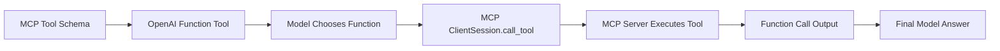

# MCP Demo — Python Agent Tooling from the Ground Up

<p align="center">
  
  
  
  
</p>

<p align="center">
  <strong>A production-oriented, runnable example of the <a href="https://modelcontextprotocol.io/">Model Context Protocol (MCP)</a> using Python, the official MCP Python SDK, stdio transport, Pydantic, and OpenAI function calling.</strong>
</p>

---

## What is MCP?

> **MCP (Model Context Protocol)** is a standardized protocol that lets AI applications discover and use external **tools, resources, and prompts** through one consistent interface.

Instead of every AI framework inventing a different integration for every database, API, filesystem, or internal service, an MCP host can connect to an MCP server and use the same protocol surface.

### Problems MCP Solves

| Problem | MCP Solution |
|---------|--------------|
| **Vendor lock-in** | Integrations expose capabilities through MCP rather than tying to one model provider or agent framework |
| **Inconsistent tool-calling** | Tools have machine-readable schemas and standardized discovery/call semantics |
| **No context persistence** | MCP separates context/tool providers from the model, enabling long-lived connections |
| **Dynamic data sources** | Databases, APIs, files, and internal systems wrapped as MCP resources/tools without embedding implementation into model runtime |

On the wire, MCP uses **JSON-RPC 2.0 messages** over transports such as **stdio** and HTTP-based transports (SSE/Streamable HTTP). This repository uses **stdio**: the client launches the server as a subprocess, sends protocol messages through stdin, and receives responses through stdout.

---

## Architecture

```mermaid
flowchart TD
    A[User: "What's the weather in London?"] --> B[AI Agent<br/>OpenAI Responses API]
    B --> C[1. Discovers MCP tools]
    B --> D[2. Decides whether to call]
    B --> E[3. Emits function call]
    E --> F[MCP Client<br/>ClientSession + stdio]
    F --> G[initialize]
    F --> H[tools/list]
    F --> I[tools/call]
    I --> J[JSON-RPC 2.0<br/>stdin/stdout]
    J --> K[MCP Server subprocess]
    K --> L[get_current_weather tool]
    K --> M[greeting://{name} resource]
```

### Why the Official SDK?

This repository uses the official Python MCP SDK instead of reimplementing the protocol. The SDK supplies:
- Protocol lifecycle & validation
- Transport abstraction (stdio, HTTP/SSE)
- Typed client/server APIs

The application code still makes the important MCP concepts explicit: server registration, tool schemas, `initialize`, `tools/list`, `tools/call`, resource reads, and stdio process management.

> The current SDK's stable v2 API uses `MCPServer` for server construction and `ClientSession`/`stdio_client` for stdio clients.

---

## Project Layout

```
mcp-demo/
├── README.md
├── requirements.txt
├── .env.example
├── pyproject.toml
├── src/
│   ├── mcp_server/
│   │   ├── __init__.py
│   │   ├── server.py      # MCP server entry point
│   │   ├── tools.py       # Tool implementations
│   │   ├── handlers.py    # Request handlers
│   │   └── utils.py       # Shared utilities
│   ├── mcp_client/
│   │   ├── __init__.py
│   │   ├── client.py      # MCP client wrapper
│   │   ├── agent.py       # OpenAI agent integration
│   │   └── runner.py      # Demo runner
│   └── shared/
│       ├── __init__.py
│       └── types.py       # Shared Pydantic models
├── tests/
│   ├── test_server.py
│   └── test_client.py
├── examples/
│   └── demo.ipynb
└── scripts/
    └── run_demo.sh
```

---

## Requirements

- **Python 3.10+**
- **OpenAI API key** (for the AI-agent demo)
- **No weather API key required** — the weather tool uses deterministic sample data so the MCP path works offline

---

## Quick Start

### 1. Create Virtual Environment

```bash
python -m venv .venv
source .venv/bin/activate        # Linux/macOS
.venv\Scripts\Activate.ps1       # Windows PowerShell
```

### 2. Install Dependencies

```bash
python -m pip install --upgrade pip
pip install -r requirements.txt
```

### 3. Configure OpenAI

```bash
cp .env.example .env
```

Edit `.env` with your credentials:

```env
OPENAI_API_KEY=your_api_key_here
OPENAI_MODEL=gpt-4.1-mini
```

> The server itself does **not** need the OpenAI key.

---

## Run the Demo

### From Repository Root

```bash
python src/mcp_client/runner.py
```

**What the runner does:**

| Step | Description |
|------|-------------|
| 1️⃣ | Launches `src/mcp_server/server.py` as a child process |
| 2️⃣ | Performs MCP initialization handshake |
| 3️⃣ | Calls `tools/list` |
| 4️⃣ | Converts discovered MCP schemas → OpenAI function tools |
| 5️⃣ | Asks model to answer a natural-language question |
| 6️⃣ | When model chooses `get_current_weather`, sends `tools/call` through MCP |
| 7️⃣ | Sends MCP result back to model |
| 8️⃣ | Prints final answer |
| 9️⃣ | Shuts down server cleanly |

### Alternative: Shell Wrapper

```bash
bash scripts/run_demo.sh
```

---

## Expected Output

Exact wording varies by model, but the log flow looks like:

```text
INFO mcp_client.client: -> MCP initialize
INFO mcp_client.client: <- MCP initialize: server=mcp-demo-server
INFO mcp_client.client: -> MCP tools/list
INFO mcp_client.client: <- MCP tools/list: ["get_current_weather"]
INFO mcp_client.agent: User: What's the weather in London?
INFO mcp_client.agent: OpenAI requested tool: get_current_weather {"city":"London","units":"metric"}
INFO mcp_client.client: -> MCP tools/call name=get_current_weather arguments={"city":"London","units":"metric"}
INFO mcp_server.tools: weather lookup city=London units=metric
INFO mcp_client.client: <- MCP tools/call result={"city":"London","temperature":18.0,...}
INFO mcp_client.agent: Final: London is 18°C and partly cloudy.
```

> The logs deliberately show MCP semantic messages at the application boundary. The SDK handles JSON-RPC framing internally.

---

## Run MCP Server Standalone

```bash
python src/mcp_server/server.py
```

A stdio MCP server appears to "hang" — this is **expected**. It waits for protocol messages on stdin. A host/client should launch it and own the stdio pipes.

### Interactive Protocol Inspection

```bash
pip install "mcp[cli]"
mcp dev src/mcp_server/server.py
```

---

## MCP Methods Demonstrated

The official SDK handles the JSON-RPC lifecycle:

| Method | Direction | Purpose |
|--------|-----------|---------|
| `initialize` | Client → Server | Handshake & capability negotiation |
| `tools/list` | Client → Server | Discover available tools |
| `tools/call` | Client → Server | Invoke a tool |
| `resources/list` | Client → Server | Discover available resources |
| `resources/read` | Client → Server | Read a resource |

The client explicitly calls `initialize()` before listing or invoking capabilities. The server's decorators generate tool/resource schemas from Python type annotations.

---

## Tool: `get_current_weather`

```python
get_current_weather(
    city: str,
    units: Literal["metric", "imperial"] = "metric"
) -> WeatherResponse
```

**Returns structured Pydantic-backed payload:**

```json
{
  "city": "London",
  "temperature": 18.0,
  "units": "metric",
  "condition": "partly cloudy",
  "humidity_percent": 72
}
```

> Unknown cities fail with a controlled MCP tool error rather than crashing the server.

---

## Agent Integration Flow

The agent uses **plain OpenAI function calling** (no extra framework) to keep the demo focused:



This is the same pattern agent frameworks wrap: discover MCP tools → expose schemas to model → route selected calls back through MCP → feed results into next model turn.

---

## Testing

```bash
pytest -q
```

**Test suite covers:**

- ✅ Tool execution (metric weather)
- ✅ Tool execution (imperial weather)
- ✅ Validation/error behavior (unknown city)
- ✅ In-process MCP client discovery & tool invocation

Tests use the SDK's in-memory client where possible — avoids subprocess flakiness while exercising the real MCP protocol layer.

---

## Formatting & Linting

This project uses **[Ruff](https://docs.astral.sh/ruff/)**:

```bash
# Check
ruff check .
ruff format --check .

# Format
ruff format .
```

---

## Production Notes

This demo is deliberately small, but represents several production concerns:

| Concern | Implementation |
|---------|----------------|
| **stdout discipline** | Server never prints app logs to stdout (belongs to MCP); logs go to stderr via `logging` |
| **Typed I/O** | Pydantic models validate tool inputs/outputs at application boundary |
| **Controlled failures** | Tool exceptions → MCP error results (SDK), not process crashes |
| **Subprocess lifecycle** | SDK's stdio context manager owns process startup/shutdown |
| **Least-privilege env** | MCP stdio client explicitly passes env vars needed by child process |
| **Dynamic discovery** | Agent doesn't hard-code weather tool schema; discovers via `tools/list` |

> For real external data sources: replace deterministic weather with authenticated API/database calls, add timeouts, retries, rate limiting, observability, and secrets management.

---

## Protocol Mental Model

Simplified JSON-RPC sequence:

```json
// Client -> Server
{"jsonrpc":"2.0","id":1,"method":"initialize","params":{...}}

// Server -> Client
{"jsonrpc":"2.0","id":1,"result":{...}}

// Client -> Server
{"jsonrpc":"2.0","id":2,"method":"tools/list","params":{}}

// Server -> Client
{"jsonrpc":"2.0","id":2,"result":{"tools":[...]}}

// Client -> Server
{"jsonrpc":"2.0","id":3,"method":"tools/call",
 "params":{"name":"get_current_weather","arguments":{"city":"London"}}}

// Server -> Client
{"jsonrpc":"2.0","id":3,"result":{"content":[...],"structuredContent":{...}}}
```

> The exact protocol schema is maintained by the [MCP specification](https://modelcontextprotocol.io/specification/) and the SDK. The above is intentionally simplified for teaching.

---

## References

- **Official MCP Python SDK**: https://py.sdk.modelcontextprotocol.io/
- **MCP Specification**: https://modelcontextprotocol.io/specification/
- **OpenAI Function Calling**: https://platform.openai.com/docs/guides/function-calling

---

<p align="center">
  Made with ❤️ for the MCP community
</p>